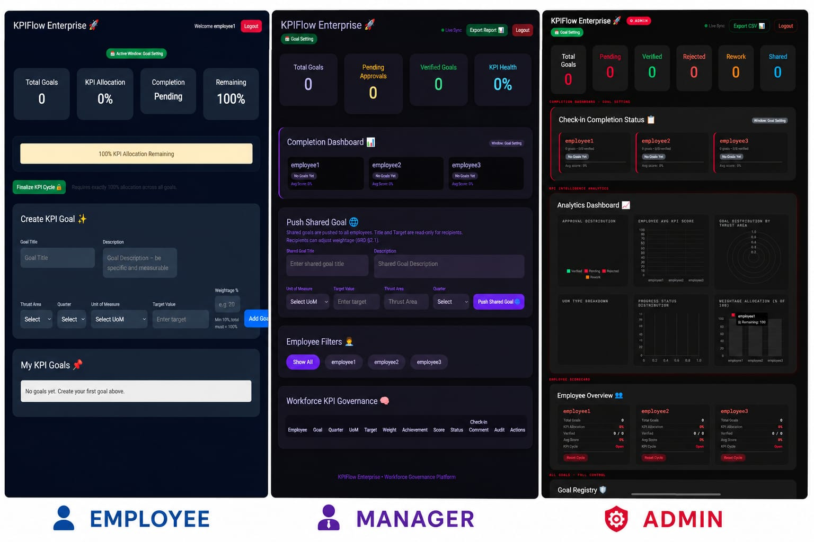
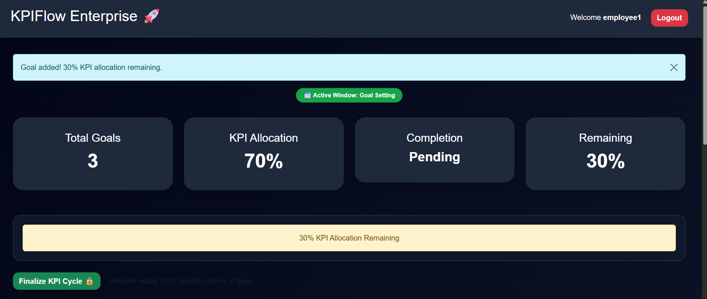
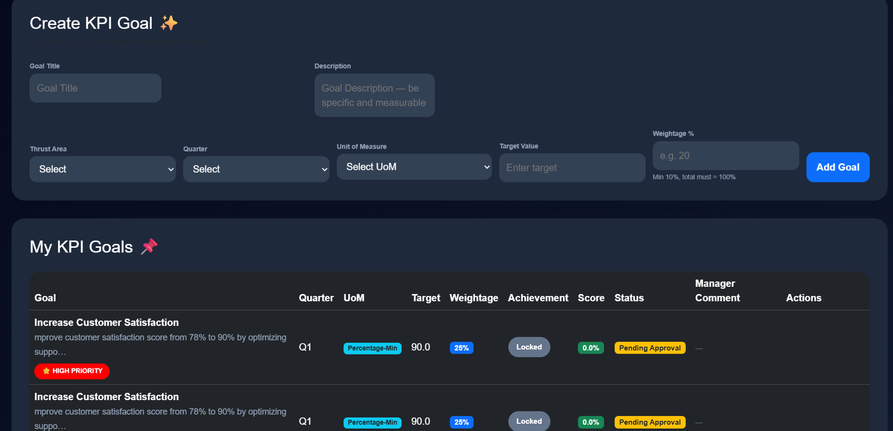
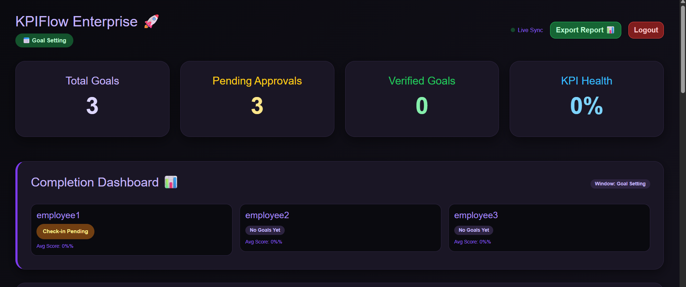
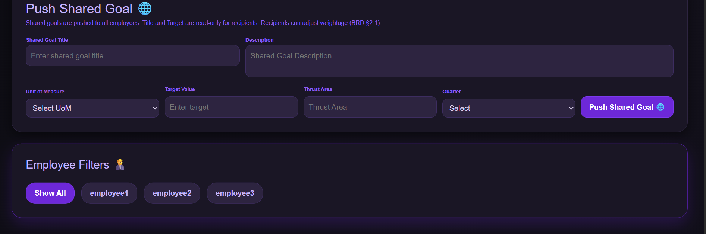
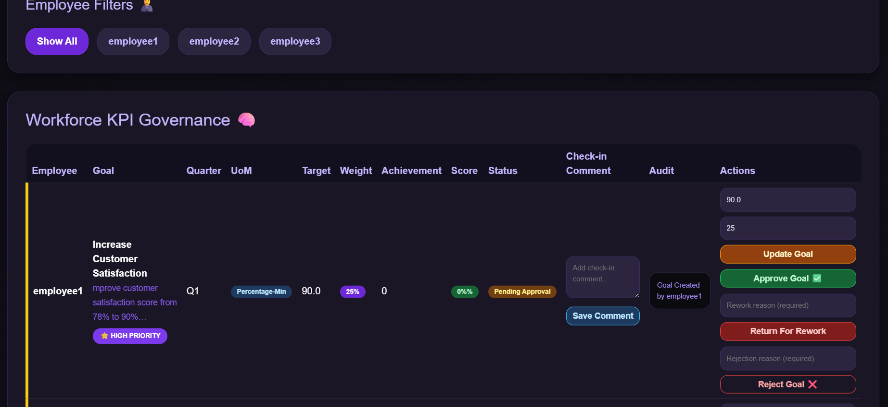
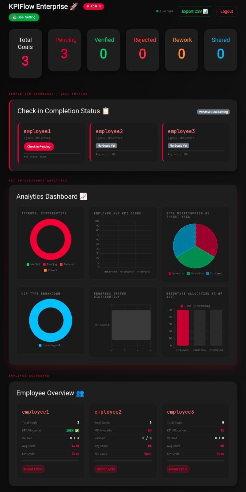
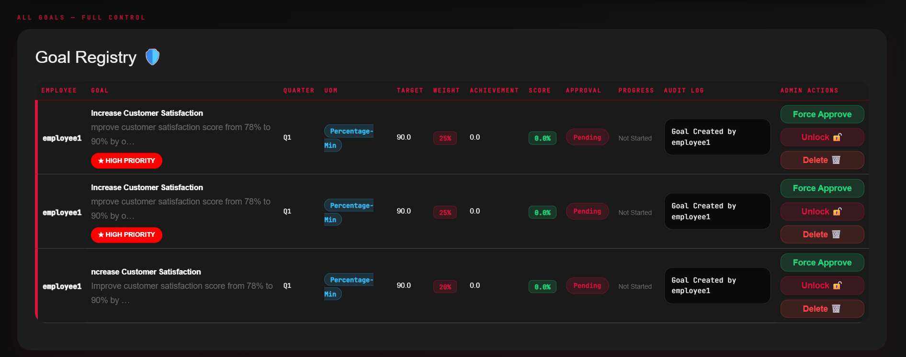

# KPIFlow Enterprise 🚀  
### Enterprise KPI Governance & Workforce Performance Platform

<p align="center">


</p>

---

# 🌌 Overview

KPIFlow Enterprise is a modern enterprise KPI governance platform built for **AtomQuest Hackathon 2026** to streamline workforce performance management, KPI lifecycle governance, approval workflows, and enterprise analytics visibility.

The platform replaces fragmented spreadsheet-driven KPI systems with a centralized cloud-based governance ecosystem featuring:

- 🎯 KPI Goal Creation
- ✅ Approval & Rework Workflows
- 📊 Workforce Analytics
- 📈 Quarterly KPI Tracking
- 🛡️ Governance Visibility
- 📋 Audit Logging
- ☁️ Cloud Deployment

KPIFlow Enterprise is designed as an internal enterprise SaaS prototype focused on governance transparency, operational visibility, and scalable KPI lifecycle management.

---

# ✨ Core Highlights

| Capability | Description |
|---|---|
| 🧠 Governance Workflow | Structured KPI approval, rejection, and rework lifecycle |
| 📡 Real-Time Sync | SSE-powered live dashboard synchronization |
| 📊 Workforce Analytics | Enterprise KPI visibility and monitoring |
| 🏢 Multi-Role Architecture | Employee, Manager, and Admin operational layers |
| 📝 Audit Logging | Governance-ready KPI traceability |
| ☁️ Cloud Hosted | Public deployment using Render infrastructure |
| 🎨 Role-Based UI | Distinct enterprise dashboard identity for each role |

---

# 🚀 Live Deployment

## 🌐 Working Application

👉 https://kpiforge.onrender.com

> **Deployment Note:**  
> The platform is deployed using Render’s free-tier cloud infrastructure. Initial requests after inactivity may experience brief cold-start latency due to automatic instance suspension behavior.

---

# 💻 Source Repository

## 🔗 GitHub Repository

👉 https://github.com/gautam-gowda/KPIForge

---

# 📄 Technical Documentation

👉 [View Full Submission Document](docs/KPIFlow_Enterprise_Submission.pdf)

---

# 📸 Dashboard Preview

<p align="center">
  
</p>

---

# 🧩 Enterprise Workflow

```text
Employee Goal Creation
          ↓
Manager Approval Workflow
          ↓
Quarterly KPI Tracking
          ↓
Performance Validation
          ↓
Enterprise Analytics & Governance
```

---

# 🏗️ Enterprise System Architecture

```text
Employees / Managers / Admins
                ↓
Frontend Interface Layer
     HTML • CSS • JavaScript
                ↓
Governance Workflow Engine
 Approval • Rework • Validation
                ↓
Flask Backend Services
 Session Management • Business Logic
          ↙              ↘
Analytics Engine      Audit Logs
                ↓
SQLite Database
                ↓
Render Cloud Deployment
```

---

# 🔥 Key Innovation Highlights

## ⚡ Real-Time Dashboard Synchronization

Implemented using **Server-Sent Events (SSE)** to provide live governance visibility without requiring manual dashboard refreshes.

---

## 🧠 Governance-Driven KPI Lifecycle

Supports:

- Goal Approval
- Goal Rejection
- Rework Requests
- Finalization Controls
- Shared Goal Distribution

through a structured enterprise workflow architecture.

---

## 📊 Multi-Type KPI Scoring Engine

Supports multiple KPI scoring formats:

- Percentage-Based
- Numeric
- Currency
- Boolean
- Rating-Based
- Milestone-Oriented

---

## 🛡️ Enterprise Audit Visibility

Every KPI operation is logged for governance traceability including:

- approvals
- rejections
- edits
- goal lifecycle changes
- administrative actions

---

# 🖥️ Dashboard Ecosystem

# 👨‍💼 Employee Dashboard

<p align="center">
  
</p>

<p align="center">
  
</p>

### Features

- KPI Goal Creation
- KPI Allocation Validation
- Goal Finalization Workflow
- Progress Tracking
- KPI Visibility Monitoring
- Quarterly Check-ins

### UI Identity

Deep blue productivity-oriented enterprise workspace.

---

# 🧑‍💻 Manager Governance Dashboard

<p align="center">
  
</p>

<p align="center">
  
</p>

<p align="center">
  
</p>

### Features

- KPI Approval / Rejection
- Rework Governance Pipeline
- Shared Goal Distribution
- Workforce KPI Monitoring
- Employee Filtering
- Governance Visibility

### UI Identity

Purple governance-oriented workflow environment.

---

# 🛡️ Administrative Analytics Dashboard

<p align="center">
  
</p>

<p align="center">
  
</p>

### Features

- Enterprise KPI Analytics
- Goal Registry Management
- KPI Health Monitoring
- Workforce Visibility
- Administrative Controls
- Exportable Reports

### UI Identity

Charcoal-black and crimson-red executive analytics environment.

---

# 🧪 BRD Requirement Alignment

## ✅ Phase 1 — Goal Creation & Approval

- KPI creation workflow
- Weighted KPI allocation
- UoM assignment
- Goal approval lifecycle
- Shared goal distribution

---

## ✅ Phase 2 — Achievement Tracking

- Quarterly check-ins
- KPI performance scoring
- Goal progress monitoring
- Achievement updates
- Manager review workflows

---

## ✅ Governance & Reporting

- Audit trail logging
- Completion dashboards
- Exportable reporting
- KPI analytics
- Administrative governance

---

# ⚙️ Technology Stack

| Layer | Technology |
|---|---|
| Backend | Flask (Python) |
| Frontend | HTML, CSS, JavaScript |
| Database | SQLite |
| Charts & Analytics | Chart.js |
| Real-Time Updates | Server-Sent Events (SSE) |
| Deployment | Render Cloud Platform |
| Version Control | Git & GitHub |

---

# 🔐 Demo Credentials

| Role | Username | Password |
|---|---|---|
| Employee | employee1 | pass123 |
| Manager | manager | pass123 |
| Admin | admin | pass123 |

---

# 🎨 UI/UX Design Strategy

KPIFlow Enterprise uses visually differentiated enterprise dashboard environments for operational clarity and governance separation.

| Dashboard | Design Philosophy |
|---|---|
| Employee | Productivity-oriented operational workspace |
| Manager | Governance-driven approval environment |
| Admin | Analytics-focused executive oversight layer |

This role-specific UI identity improves:

- usability
- workflow recognition
- governance clarity
- operational focus

---

# 📈 Future Scope

Potential future enhancements include:

- 🤖 AI-driven KPI recommendations
- 📡 Real-time notifications
- 🏢 HRMS / ERP integrations
- 📊 Advanced analytics intelligence
- ☁️ Distributed cloud architecture
- 🔐 SSO & OAuth integration
- 📱 Mobile enterprise companion app

---

# 🏆 Project Vision

KPIFlow Enterprise demonstrates:

✅ Full-stack engineering  
✅ Governance workflow architecture  
✅ Real-time synchronization  
✅ Enterprise analytics integration  
✅ Cloud deployment maturity  
✅ Role-based operational ecosystems  

The platform is designed as a scalable internal enterprise KPI governance solution focused on workforce visibility, operational accountability, and governance transparency.

---

# 👨‍💻 Developed By

## Gautam Gowda

### AtomQuest Hackathon 2026 Submission

---
